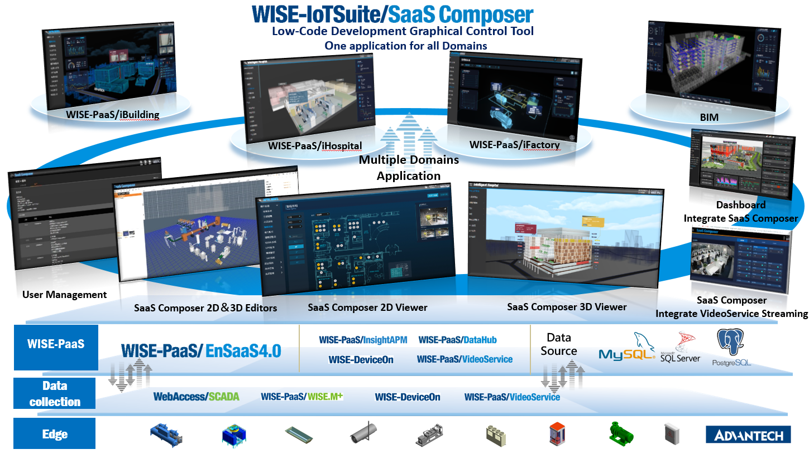
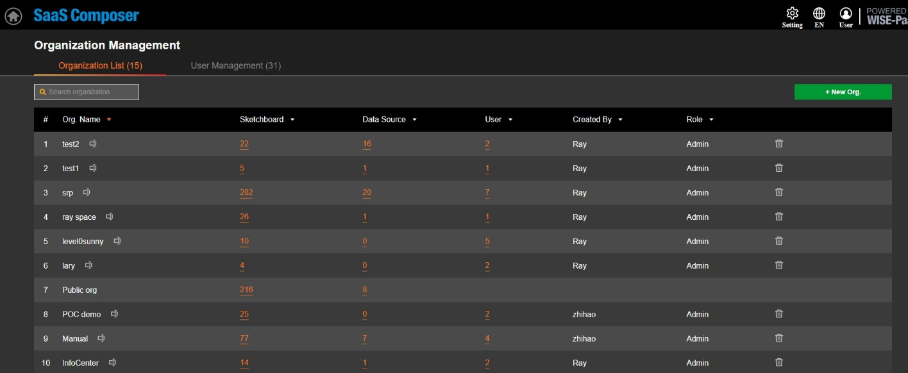
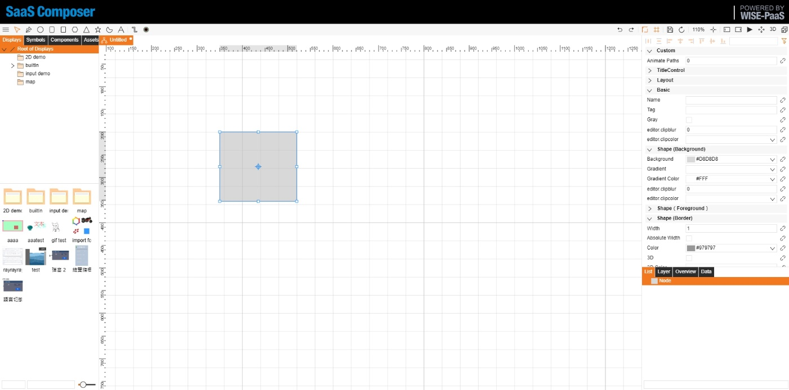
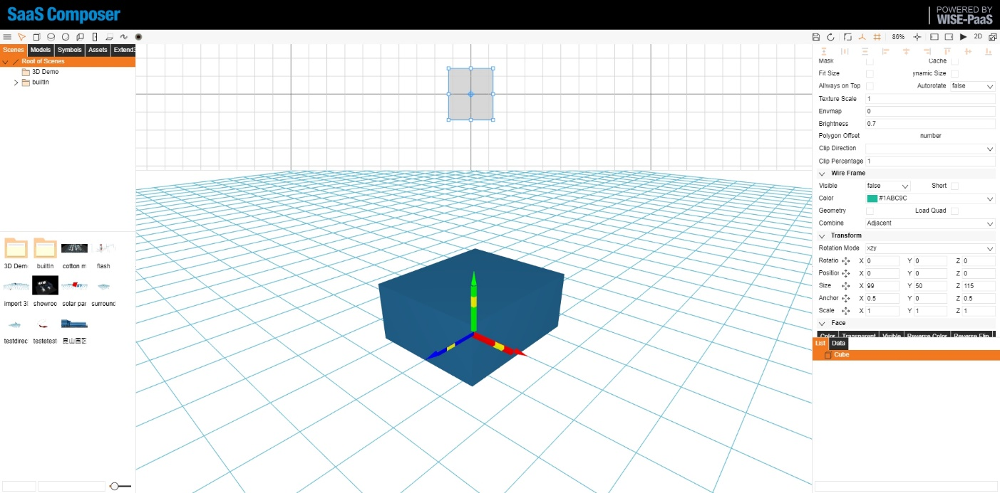

# SaaS Composer Introduction

SaaS Composer is a browser based infrastructure, which replaced the traditional IDE limitations and allow cross platform usage. This satisfies variety of industrial domains and business solutions. With 100% customization ability, users can reconstruct the on-site environment and offer a live detailed representation.

Through its user-friendly interface, component and object binding are no long an issue. Multiple animations can be easily applied to any object and also with its high-speed refresh rate that can prevent delay in graphical presentation.

Constructed on the HTML 5 Canvas technology, virtual canvas display can be achieved, this prevent picture distortion and allow user to zoom in/out to observe the detail of the image. 

# Architecture  

Currently, data collection is no longer an unreachable technology like in the past. The Internet of Things has allowed all information collection to be upgraded to one-click completion. Data visualization tools provide an accessible way to see and understand trends, outliers in data. The strength of WISE-PaaS/SaaS Composer is to help customers solve data visualization problems. Low-code development platform. Simple and easy-to-understand visual presentation. Drawing out the different actual scenes of each application scenarios and matching real-time/historical information, fields, data, alarms, characteristic values, like Digital twin. All presented information on the screen at once.  

## User authority management

## 2D Editor

## 3D Editor

## 2D Viewer

## 3D Viewer

# Glossary  

● SC  
SaaS Composer abbreviation  

● SSO  
Single Sign-On WISE-PaaS log-in mechanism  

● SC Sketchboard or Sketchboard  
2D or 3D editor interface  

● SC Management or Management  
User management system  

● Org. or Org  
Organization abbreviation
SaaS Composer's Management can create multiple Organizations，each Organization is managed and functioned independently, will not interference with one another. For each independent Organization, their user authority is created and controlled by the Admin user inside of the organization.  

● Management Portal  
WISE-PaaS platform management interface  

● Assets  
Resources, basic element，support format type（PNG, JPEG, SVG）  

● Components   
Modules, edit component detail properties，logic/script handle  

● Symbols   
Based on mulptile Assets, Components and element，constructed as one single object  

● Displays   
Display unit for 2D viewer, based on mulptile Assets, Symbols and element, constructed as one single Display for viewer, can be viewed by URL directly  

● Scenes  
Display unit for 3D viewer, based on mulptile Assets, Symbols and Models, constructed as one single Display for viewer, can be viewed by URL directly  

● SRP  
Solution Ready Package abbreviation  

● InsightAPM  
Insight Asset Performance Management abbreviation  

# Minimum Requirements  

<table>
    <thead>
        <tr>
            <th>Service plan</th>
            <th>CPU(Core)</th>
            <th>RAM(GB)</th>
            <th>Ephemeral Storage(GiB)</th>
        </tr>
    </thead>
    <tbody>
        <tr>
            <td>Standard</td>
            <td>0.3 core</td>
            <td>768M</td>
            <td>1200M</td>
        </tr>
        <tr>
            <td>Professional</td>
            <td>0.3 core</td>
            <td>768M</td>
            <td>1200M</td>
        </tr>
    </tbody>
</table>

Service plan   | CPU(Core)  | RAM(GB)  | Ephemeral Storage(GiB)
---------------|------------|----------|-------------------------
Standard       | 0.3 core   | 768M     | 1200M
Professional   | 0.3 core   | 768M     | 1200M
  
recommended browser: Chrome, Edge, Firefox

Client side requirements:
- System：Windows 7+、OS X、Linux  
- CPU：CPU2.0GHz Dual Core  
- Memory：4G or more  
- GPU：Inter(R) HD Graphics 520
- Hard disk：300GB minimum

Browsers requirements:   
- 2D Displays (minimum)IE9+  
- 3D Scenes IE11+  
- Other modern browsers: Chrome, Edge, Firefox