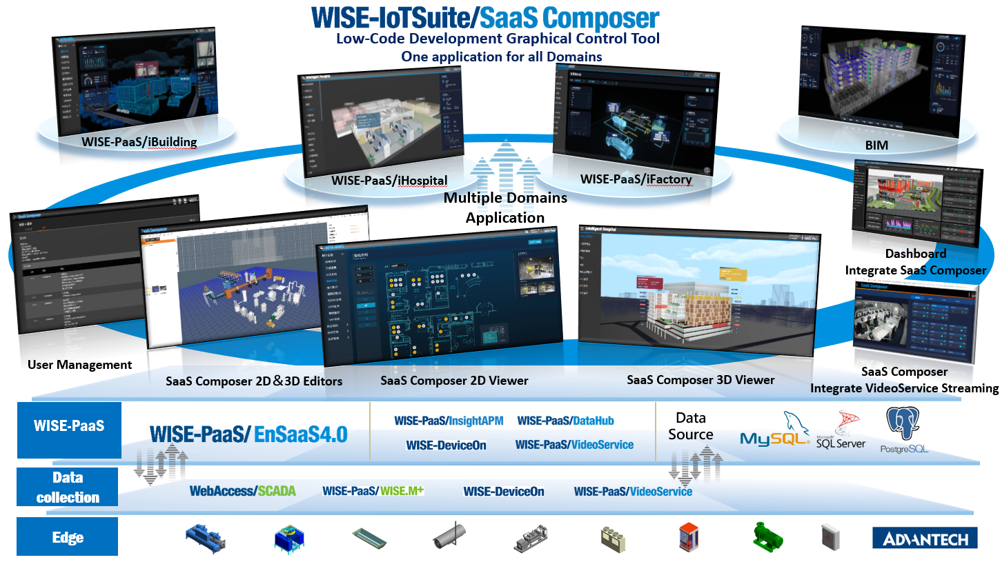
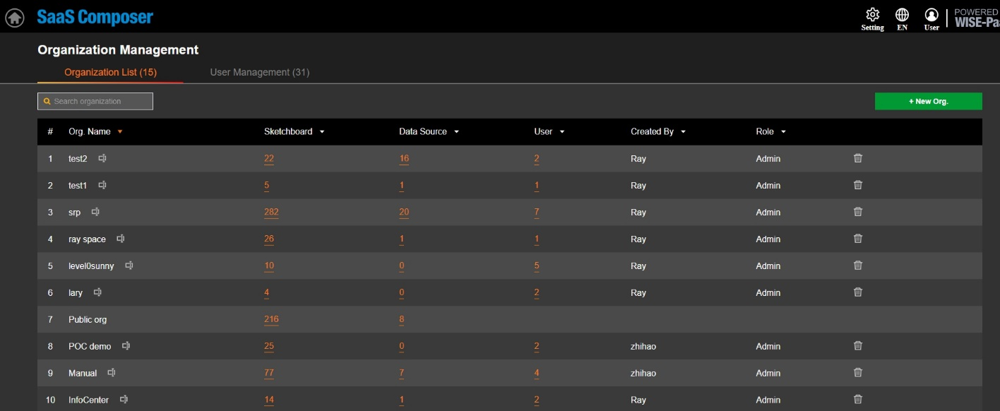
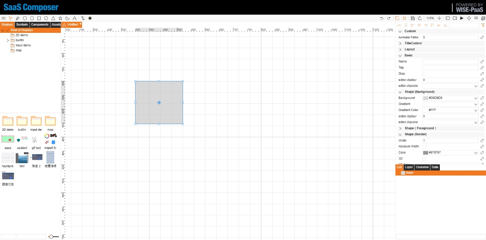
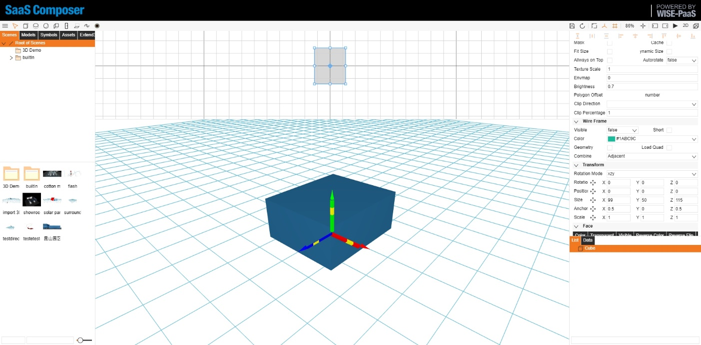
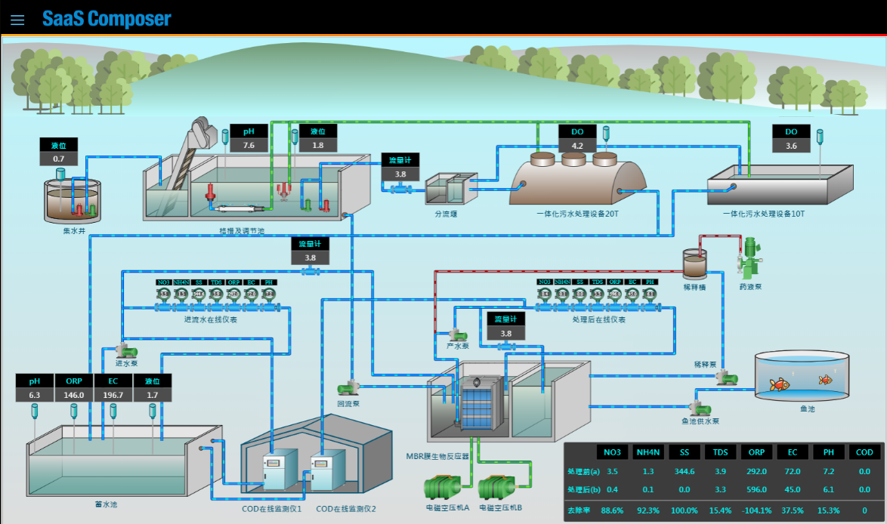
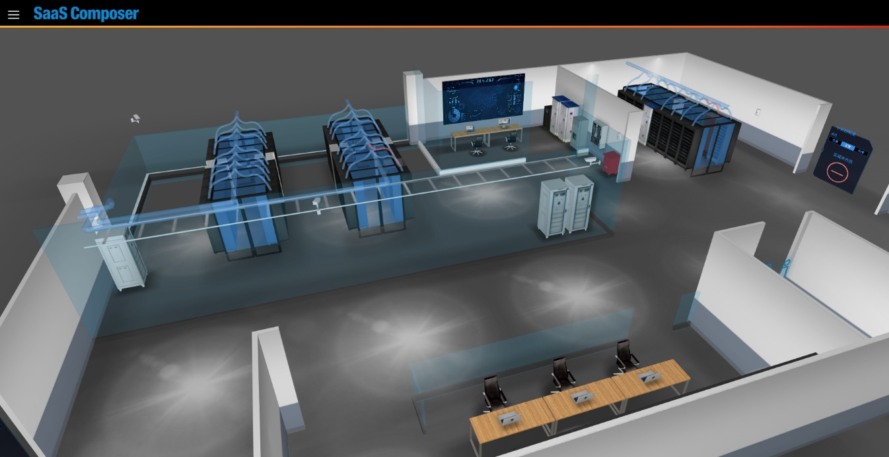

# SaaS Composer簡介

SaaS Composer以全瀏覽器跨平台架構的設計，取代傳統圖控的IDE限制，以滿足多元行業應用及100%客製化的需求呈現，以展現即時動態資訊及遠端操控。透過高直覺性且易於操作的的使用介面，在物件綁定功能上，可呈現多重動畫以及毫秒等級的畫面刷新速度。
圖形繪製以HTML5 Canvas技術為基礎，支援虛擬畫布的顯示畫面，預防畫面失真問題，亦可支援標準JavaScript撰寫，在物件屬性上做邏輯分析處理。
SaaS Composer流程視覺化雲端組態工具，可搭配Dashboard將關鍵管理資料以視覺直觀呈現，協助萃取資料價值協助全面提升數據價值與運營效率，管理效益再升級
協助全面提升數據價值與運營效率，為各行各業客戶夥伴完整體現物聯網管理效益！

以目前的應用市場上，數據採集已經不再是像過去遙不可及的門檻，物連網的快速提升讓所有資訊收集升級到一鍵完成，大數據分析，資料預測等等都成為雲上客戶所必備的資訊。目前應用市場中客戶遇到的問題不外乎都跟龐大的資料分析結果和數據採集後的處理煩惱相關。SaaS Composer 強項就是專門幫客戶解決資料呈現的問題。簡而易懂的視覺化呈現，繪製出每個客戶不同的實際場景和搭配即時/歷史等重要資訊，場域，數據，警報，特徵值… 完整的一次呈現在畫面上。

## 使用者權限管理

## 2D Editor

## 3D Editor

## 2D Viewer

## 3D Viewer

# 產品優勢  

● 100%客制化圖形呈現，滿足不同領域運用：

SaaS Composer以全流覽器跨平臺架構的設計，取代傳統圖控的IDE限制，可以依照不同垂直領域繪製圖本，展現即時動態資訊及遠端操控；3D支持標準通用.OBJ 與 .MTL、3D幾何圖形檔案格式；

● 毫秒等級刷新，即時資料呈現：

SaaS Composer通過易於操作的使用介面，支援多重動畫以及毫秒等級的畫面刷新速度。同時，使用者也無需擔心畫面播放時間過長、緩存過多造成畫面卡住的問題；

● 預防畫面失真呈現：

圖形繪製以HTML5 Canvas技術為基礎，支援虛擬畫布的顯示畫面，放大縮小畫面，都不會有失真的問題發生；

● 達到精准邏輯操控與分析：

支持標準JavaScript撰寫，對資料進行二次編輯，使用者可以進行羽量級的邏輯分析處理；

● WISE-PaaS平臺資料串聯：

整合WISE-PaaS平臺服務，搭配Dashboard強化整體視覺化效果，同時與平臺資料結構進行資料串聯，協助您全面提升資料價值與運營效率；

● 使用者許可權分類，有效管理檔案：

如上面提到的使用者管理系統，SaaS Composer把平臺上的許可權分為兩種：Admin User和Normal User，讓使用者方便管理檔案及隱私透明度。

●支援多種不同類型檔案匯入，即可立即呈現 :

可直接使用第3方繪製出完成品來使用，可使用JPEG, PNG, MP3, MP4, SVG等向量圖型匯入。

●支援檔案Import & Export 功能 :

支援檔案匯入匯出，方便模型存取與分享

●支援 iframe 坎入網頁影片等功能  :

SaaS Composer支援崁入影像 網頁畫面，豐富圖面顯示，增加畫面訊系內容

●專門為圖控軟件開發動畫功能 :

包含圖控相關行為，警報處理，閃爍提示，移動動畫…等等內鍵功能

# 名詞解釋  

● SC
SaaS Composer名稱縮寫

● SSO
Single Sign-On WISE-PaaS 登入機制

● SC Sketchboard or Sketchboard
2D 或 3D編輯器繪圖介面

● SC Management or Management
使用者管理系統

● Org. or Org
Organization名稱縮寫
SaaS Composer 的Management可以新增多數的 Organizations，內層使用者等同於在Organization裡面使用的使用者，各個Organization裡的權限管理都是獨立的，不會互相干擾。

● Management Portal
WISE-PaaS平台管理介面

● Assets 
資源 基礎元件，支援檔案格式（PNG, JPEG, SVG）

● Components 
組件 編輯物件屬性的細項，邏輯/script處理

● Symbols 
圖標 由多項元件，組合而成的物件

● Displays 
2D圖紙 由多項物件(圖標，資源), 組合而成的畫布

● Scenes
3D場景 由多項物件(圖標，資源, 模型), 組合而成的畫布

● SRP
Solution Ready Package名稱縮寫

● InsightAPM
Insight Asset Performance Management 名稱縮寫

# Minimum Requirements  

Service plan   | CPU(Core)  | RAM(GB)  | Ephemeral Storage(GiB)
---------------|------------|----------|-------------------------
Standard       | 0.3 core   | 768M     | 1200M
Professional   | 0.3 core   | 768M     | 1200M

recommended browser: Chrome, Edge, Firefox

客戶端配置要求：  
- 系統：Windows 7+、OS X、Linux  
- CPU：雙核 CPU2.0GHz及以上  
- 內存：4G 及以上  
- 顯卡：Inter(R) HD Graphics 520 及以上  
- 硬盤：300GB 及以上  

瀏覽器要求:   
- 2D 拓撲圖需要 IE9+  
- 3D 場景需要 IE11+  
- 其他瀏覽器較近版本皆可  
客戶端配置無上限，場景面數越多需要配置越高  