# 1- Introduction

## 1.1 Purpose
A feature that enables visualization of Advantech's WISE-PaaS software. SaaS Composer is a software program for graphic customization that allows you to create vertical process diagrams for real-time data display and control.

The program is a browser-based, multi-platform diagramming tool that supports multiple animation effects, layering, undistorted vector graphics, and millisecond refresh rates, and provides you with scripts for precise logic control and analysis.

It operates a user account management system and defines different user roles.
SaaS Composer boasts two features:

-- Management (a user management system)

-- Sketchboard (a diagramming program for graphic customization)

## 1.2 Specification
WISE-PaaS Service Instance:

PostgreSQL 9.3 or above

WISE-PaaS ES 4.0 Application Instance:

- SaaS Composer

  -- CPU: 0.3 Core

  -- Memory: 768 MB

  -- Ephemeral-Storage: 1.2 GB

Sketchboard uses a graphical user interface (UI) based on HTML5 and supports HTML5-based browsers, including Chrome, Firefox, Safari, Opera and those used on mainstream mobile OS such as iOS and Android. We recommend updating your browser before you install and run Sketchboard on it.

## 1.3 Overall Structure

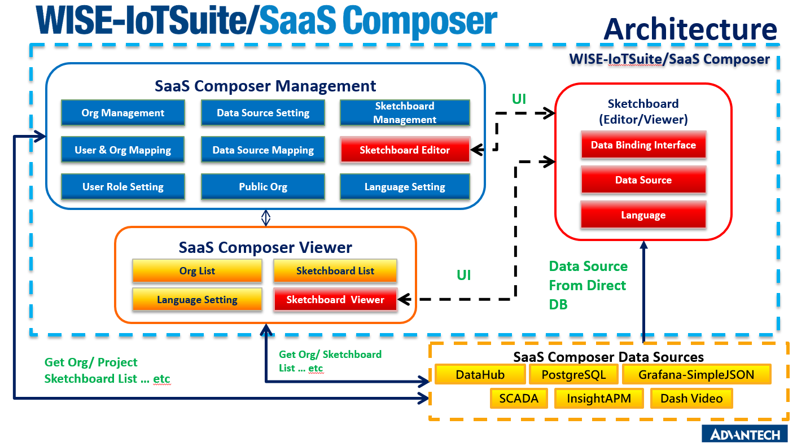

The diagram above depicts SaaS Composer's functional architecture, which is divided into three sections: Management, Viewer, and Sketchboard. The Management section consists of user role management functions (as represented by blue blocks); the Viewer section comprises tabs that are displayed on Sketchboard (as represented by orange blocks); and the Sketchboard section spans diagramming apps (as represented by red blocks). SaaS Composer accesses data stored in the WISE-PaaS PostgresSQL database.

# 2- SaaS Composer - Management

## 2.1 Overview of User Roles

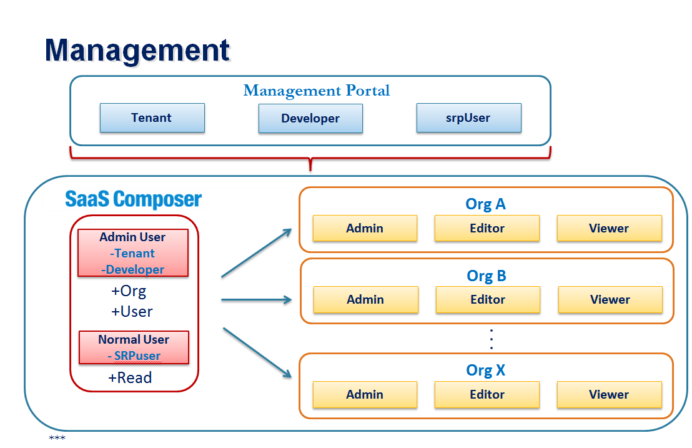

The management functionality of SaaS Composer is divided into external and internal layers.

## 2.2 User Roles Within the External Management Layer

The Management Portal (portal-management.wise-paas.com) allows you to manage your org/space role on WISE-PaaS. The portal defines three user roles: Tenant, Developer, and srpUser.

SaaS Composer's management functionality assigns a role for management through the user's privilege setting on the Management Portal upon their access to SaaS Composer. Tenants and Developers are assigned a role of "Admin User" , wheres srpUsers are given a role of "Normal User."

An Admin User can create an organization and add a user. A normal user can read only while serving the role they are assigned in an organization.

## 2.3 User Roles Within the Internal Management Layer

SaaS Composer's management functionality allows you to create multiple organizations. Internal management users can execute commands only within their respective organizations.

Internal management users can be divided into three different roles within an organization: Admin, Editor, and Viewer. These three roles are defined according to what commands they can execute within an organization:

**Admin**

- Can add, edit, or view Sketchboard

- Can add or edit a data source

- Can add or delete a user

**Editor**

- Can add, edit, or view Sketchboard

- Can add or delete a data source

- Cannot add or delete a user

**Viewer**

- Can view Sketchboard

- Cannot add or delete a data source

- Cannot add or delete a user

## 2.4 Management User Interface

The UI for SaaS Composer's management functionality comprises the Main Page and Organization Page. Some miscellaneous settings can also be configured on this UI.

**Main Page**

The Main Page lists all users and the organizations which users who have logged in belong to. Here, you can change configurations (editing, adding, or deleting) depending on your user role.

**Organization Page**

The Organization Page displays the information about the organization that the user has just clicked on. Such information includes display and data source, and users with different roles. On this page, you can change configurations (editing, adding, or deleting) depending on your user role.

**Miscellaneous settings**

These are language, username and password, and version information.

### 2.4.1 User List

1. Names of external management users (each name contains 64 characters at most)
2. Email addresses of external management users
3. Organizations which users belong to
4. Levels of privilege that users can exercise within their organizations
5. Field for querying users
6. Add a user (available depending on your user role)
### 2.4.2 Organization List

1. Name (64 characters at most)
2. Number of Sketchboard displays saved
3. Number of data sources
4. Number of users within each organization
5. Creator
6. Add a user
7. Field for querying an organization
8. Organization List
9. User List
10. Add an organization (available depending on your user role)
11. Change settings, switch languages, or manage users here
12. Main Page

### 2.4.3 Sketchboard List

1. Name
2. Creators
3. Rearrange sketchboards
4. Sketchboard Field for querying a sketchboard
5. Switch between "Sketchbaord," "Data Source," and "User" lists
6. Add a sketchboard

### 2.4.4 Data Source List

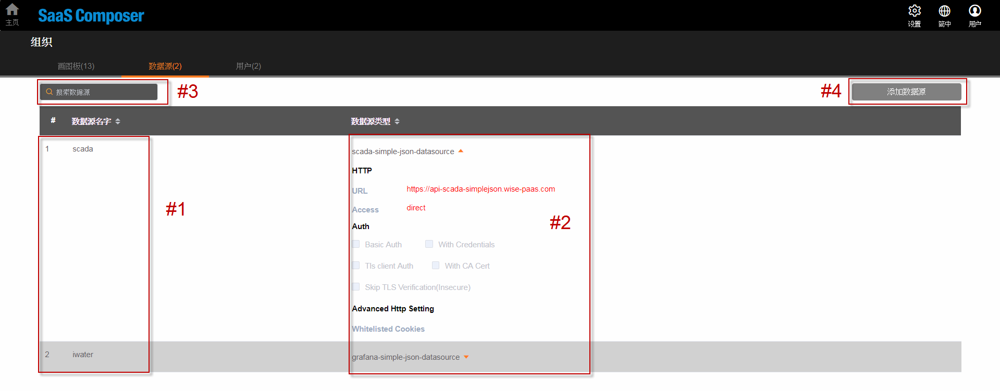

1. Name (each 64 characters at most)
2. Properties
3. Query a data source
4. Add a data source (available depending on your user role)

### 2.4.5 User List

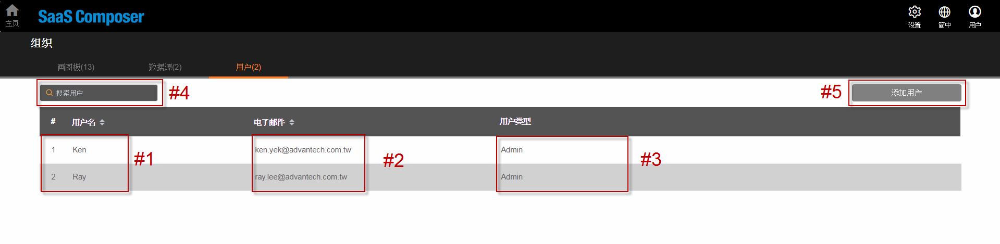

1. Name
2. Email address
3. Role
4. Field for querying a user
5. Add a user (available depending on your user role)

--Note:

  a) Each organization has at least one Admin user responsible for validating the deletion of a user

  b) If you delete the last user within an organization, a prompt will pop up terminating this deletion.

### 2.4.6 project setting  

  

1. Enable BIM function.  
2. Enable Viewer login.  
3. Add three party js & css file by url.  

## 2.5 System informatin

1. System settings
2. Languages
3. User Info

### 2.5.1 Settings page

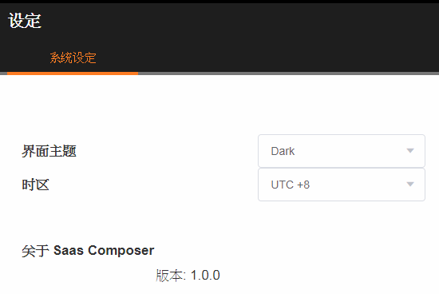

### 2.5.2 version history

### 2.5.3 User Info page

# 3- SaaS Composer - Sketchboard

## 3.1 Overview of the UI

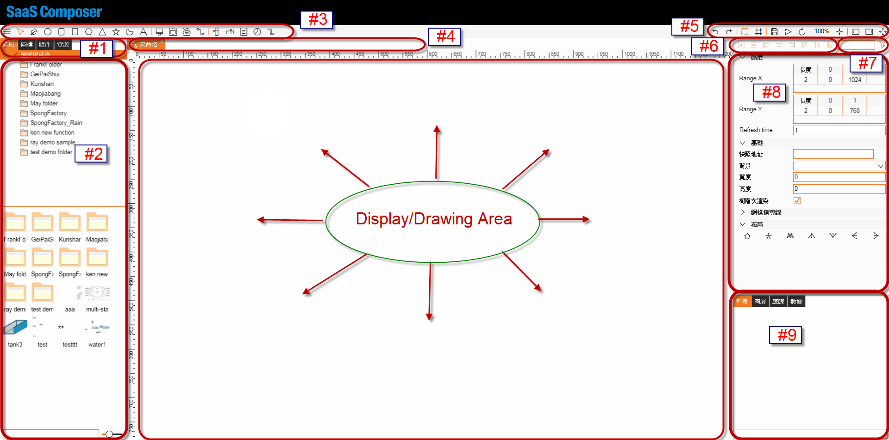

1. Four different files available for use: displays, symbols, components, and assets 
2. Tree menu for the file you have selected
3. Drawing toolbar
4. Open or edit a file
5. Function buttons
6. Hot keys for formatting
7. Field for querying the properties of the object being worked on
8. Panel showing the properties of the object being worked on
9. Table showing files and their properties

## 3.2 Terminology

-  Assets :
	Supports basic elements, PNG, JPEG, and SVG (Scalable Vector Graphics)

-  Components :	Allows you to edit components detail and compose logic scripts

-  Symbols :
	Combination of multiple Asset and Component elements, allows you to control the object as a group set

-  Displays :
	Combination of multiple Symbols and Assets, allows you to create diagram and ready for the final presentation

 **3.2.1 Assets**

- Graphics are a frequently used asset in graphical control. Sketchboard supports commercially available graphic file formats such as PNG and JPG.

- The display used on Sketchboard is pixelated and can be adjusted to any size. Sketchboard supports Scalable Vector Graphics (SVG) to display an image at different sizes without causing any distortion or fuzziness to it. Distortion and fuzziness are common problems with resized PNG and JPG images.

- SVG occupies less disk space than conventional image formats and allows an image to be proportionally resized without being distorted. All parameters of SVG images can be dynamically bound with data.

- Drag and drop a graphic of your choice into the panel under the Assets tab.

- The Assets tab displays file folders that can be organized under different categories and provides a UI into which you can drag and drop an asset-related file.

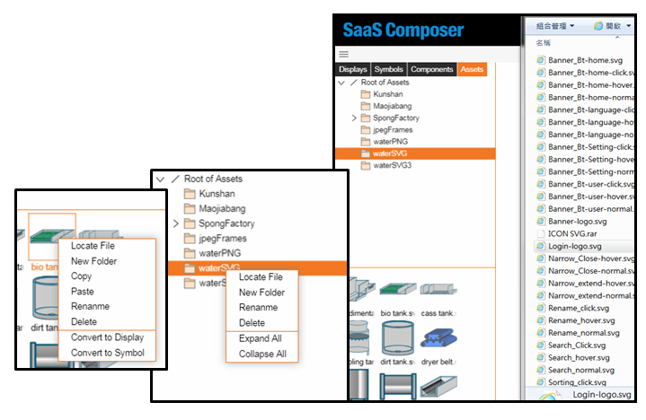

### 3.2.2 Components

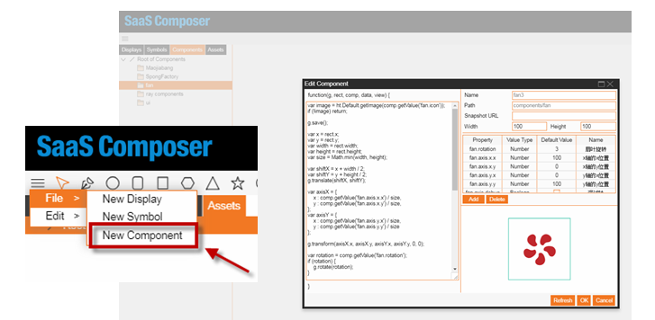

- On the Edit Component window, you can write scripts to implement JavaScript-based logic and organize objects into an animated drawing based on their properties.

- Under the Components tab, you can organize file folders under different categories.

- Components can be saved as symbols for use in the display.

### 3.2.3 Symbols

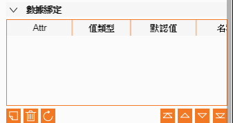

- A symbol is a major object used in the display and can be combined with components and assets for secondary logical processing.

- A uniform set of symbols is used in the display.

- You can customize properties fields and their corresponding configurations.
If you drag and drop a Displays-related graphic into the drawing area for Symbols:

- Not applicable.If you drag and drop a Symbols-related graphic into the drawing area for Symbols: 

- The Symbols-related graphic will be combined with any graphic used in that area, allowing them to be displayed together; and

- Any change made to a graphic in that combination will result in the corresponding change to others.
If you drag and drop a Components-related graphic into the drawing area for Symbols:

- The Components-related graphic will be merged with any graphic in that area, allowing them to be displayed together; and

- Any change made to a graphic in the combination will result in the corresponding change to others.If you drag and drop an Assets-related graphic into the drawing area for Symbols:

- The Assets-related graphic will be merged with any graphic in that area, allowing them to be displayed together; and

- Any change made to a graphic in combination will result in the corresponding change to others.

### 3.2.4 Displays

- The display on Sketchboard is sized in pixels.

- You can adjust the original size of the screen of the Sketchboard Viewer.

- Range X & Range Y

- Ranges X and Y specify the size of what the Sketchboard Viewer shows on the display.
  Ex:

  The display can be set to

  0–1024 px along the X-axis and

  0–768 px along the Y-axis.

- Refresh Time (sec): Amount of time for the display to be updated after a change is made to any of its properties.

If you drag and drop a Displays-related graphic into the drawing area for Displays:

- The Displays-related graphic can be presented independently of any graphic in that area, or vice versa; and

- Any change made to the Displays-related graphic will not be applied to other graphics.
If you drag and drop a Symbols-related graphic into the drawing area for Displays:

- The Symbols-related graphic will be combined with any graphic used in that area, allowing them to be displayed together; and

- Any change made to a graphic in that combination will result in the corresponding change to others.

If you drag and drop a Components-related graphic into the drawing area for Displays:
- The graphic will not appear on that area unless you convert it into a symbol.

If you drag and drop an Assets-related graphic into the drawing area for Displays:

- The Assets-related graphic will be combined with any graphic used in that area, allowing them to be displayed together; and

- Any change made to a graphic in that combination will result in the corresponding change to others.

## 3.3 Create a Display/Symbol

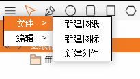

Open the SaaS Composer window, move your mouse cursor to the far left side of the toolbar on the top of the window, and click on the icon with three parallel lines. Then select New Display from File to create a blank display.

When you create a display or open an existing one, you will have a set of icons at your disposal that serve different functions:

1. Undo and redo
2. Enable scales or grids. Both icons appear in orange if enabled or gray if disabled.
3. Save
4. Preview
5. Reload
6. Change display size
7. Scale to full screen
8. Display (or hide) the left or right panel.
9. Full-screen

Click on any image on the display, and a panel showing the properties of that image will appear on the right side:

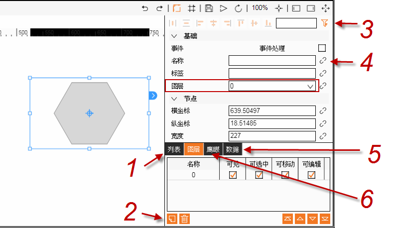

1. Tree diagram
2. Add or delete a layer, select an image, categorize layers, or choose a newly created layer from the drop-down menu of the Layer field
3. Filter properties
4. You can bind properties with functions
5. JSON description
6. Bird's eye view

Press **Ctrl + S or Cmd + S** to save, and a prompt will pop up asking you to enter a name for the newly created display or graphic. Upon entering the name, click **Confirm** to save.

## 3.4 Create Components

Open the SaaS Composer window, move your mouse cursor to the far left side of the toolbar on the top of the window, and click on the icon with three parallel lines. Then select **New Component from File** to create a component.

A set of functions will be automatically generated for use in the component: **function (g, rect, comp, data, view)**.

1. g = Drawing pen
2. rect = Rectangular boundary of a component that is drawn within a vector
3. comp = Component type of a vector graphic
4. data = Relevant data object
5. view = A parameter for viewing
6. Functions used to create an image
7. Double-click to edit
8. Registered name
9. Path of the component
10. This table shows all the properties of a created image, as well as their values and value types. Use the function "comp.getValue(property name)" to get a value for a property. You can also add or delete a property on the table.
11. Click the **Refresh** button to display the image created through the functions entered in the left panel.

## 3.5 Hot Keys

1. Zoom in: hold the - key while turning the scroll wheel of your mouse.
2. Zoom out: hold the + key while turning the scroll wheel of your mouse.
3. Fit in the window: press the 0 key.
4. Copy: **Ctrl + C**.
5. Paste: **Ctrl + V**.
6. Move up one level: Ctrl + ]. Similar hot keys include:

  Move to the top level: Alt + Ctrl + [

  Move down one level: Ctrl + [

  Move to the bottom level: Alt + Ctrl + [

7. Save: **Ctrl + S**
8. Preview: Press the **P** key.
9. Delete: Press the **Delete** key.
10. Stop drawing an irregularly shaped image: **ESC** or **Enter**
11. **Shift** a graphic horizontally: hold the **X** key while moving your mouse cursor left or right.
12. Shift a graphic vertically: hold the **Y** key while moving your mouse cursor up or down.
13. Adjust the horizontal or vertical position of a graphic while you are moving the graphic: hold the **Shift** key.
14. You can glue a graphic to an adjacent one or to a line of grids. Enable or disable grids: Press the **Cmd** or **Ctrl** key.
15. Hold the **Shift** key while dragging on an angle of the octagonal frame enclosing a graphic to resize the graphic, or rotating the graphic (with your mouse cursor clicking on the edge of the frame) and gluing it at ±15° to an adjacent one.
16. If the shape of a graphic has only two points, go to the Edit Points Mode and press the **Shift** key to glue the graphic at ±45° to an adjacent one.
17. Hand icon for panning: Press the **Space** key on the display.
18. Use arrow keys to move a display without clicking on any graphic. To move the display 10 times faster, hold the **Shift** key at the same time.
19. To move a graphic, click on it and use arrow keys. To move the graphic 10 times faster (without zooming in), hold the **Shift** key at the same time.
20. **Double-click** on an SVG image to turn it into a new display or press the **Shift** key twice to turn it into an icon.
21. Press **Shift + Delete** to disconnect polygonal line segments.
22. Hold the **Alt** key to copy and move a graphic.
23. edge or any control point on it.
24. To switch the editing mode of control points on an edge, press number keys **1** (straight), **2** (mirrored), **3** (disconnected), or **4** (asymmetric), or select any of the four modes from the properties panel on the right side of the SaaS Composer window.
25. Press the **Delete** key to remove a control point of the edge you are working on.
26. Press the **Shift** key to resize a graphic proportionally.
27. Set a center point for rotating the group of graphics you have chosen, or press the Ctrl key to rotate based on the anchor X and anchor Y of the graphic last chosen.
28. When you edit a graphic, press the **Alt** key to make a copy. Press the **Shift** key to conveniently combine graphics into a circular image.
29. Hold the **Ctrl** key while rotating several graphics you have selected. This way, each graphic is being rotated around its own center.
30. To copy a group of graphics at the same time, select all of them and hold the **Alt** key while using your mouse cursor to rotate them. When you release your mouse cursor, the graphics will be copied once at their shared central point. To copy the same graphics a second time, use your mouse cursor to rotate them and release the cursor.
31. Undo: **Ctrl + Z**
32. Redo: **Ctril +Shift + Z**
33. **Double-click** to rename a folder in a tree diagram under a tab, or right-click on the folder and choose rename from the pop-up menu.
34. **Double-click** or press the **Alt** key for any graphic listed in the Table panel to appear in a proper size.

## 3.6 Data Binding

- You can change configurations for binding data with the properties of objects on the screen.

- All properties can be bound with data.
- You can bind a single object with different types of data to create different animation effects.

### 3.6.1 Data source

- Allows you to choose a data source
- Supports the following SimpleJson 

  -- time series

  -- table
  

- Both **time series** and **table** are also used in WISE-IoTSuite/Dashboard.

### 3.6.2 Animation - Basic

- Select **Basic** or **Advanced** in Editor Mode
- Select **set match** or **set interval** for Condition

- Set match: Performs primary data matching on a given return value or, if you check the **Direct Feed** box, inputs the configurations made for the data source into Property Value fields.

  For example:
  If the return value = 1, then it is written as **False**.

  If the return value = 0, then it is written as **True**.

- Set interval: Performs primary logical processing on a given return value.

For example:

If the return value is ≤ 50, then it is written as **Low**.

If the turn value is > 50 and ≤ 100, then it is written as **High**.

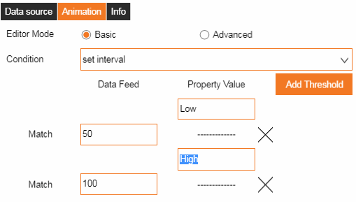

- The basic Editor Mode chooses "set match" or "set interval" depending on property configurations
- The image below shows the configurations of the "color" property:

### 3.6.3 Animation – Advanced

- In the advanced Editor Mode, you can use JavaScript to write a function for return data.

  For example:

  input = a bound return value

  output = a value written into a property

The return value is written into a property each time it increases by 1.

## 3.7 URL Parameter

- Editor:

1. https://XXXXXX.com/?
display=displays/tank3.json
(The Displays menu is similar to the RESTful API in structure.)

2. https://XXXXXX.com/?lang=en

- Viewer:

1. http://XXXXXX.com/display.html?tag=displays/ff/AAA.json
(Enter "tag" to view a diagram)

1. http://XXXXXX.com/display.html?tag=displays/ff/AAA.json&fullscreen=1
(Enter "fullscreen =1" to hide the SaaS Composer banner)

## 3.8 Script

The script in the Animation tab is written based on JavaScript. 
This script performs the following functions:
- Sets a breakpoint
- Prints out logs
- Presents shared global variables on the same tab
- Displays an alert window
- Specifies an event (an action applied on a graphic) and configures the properties displayed on the the right-hand panel of the SaaS Composer window
All content and images © by Advantech Website generated with MDwiki © Timo Dörr and contributors.
