# 使用介紹

# 1 Introduction

## 1.1 Purpose
SaaS Composer在研華的WISE-PaaS雲端平台上提供著視覺化的重要呈現。 SaaS Composer是一套客製化圖型控制系統，可以依照不同垂直領域繪製圖本，進行即時資料顯示及操控。
Browser based跨平台繪圖工具，支援多重動畫，圖層概念，向量圖型(無失真)，毫秒等級refresh速率，撰寫腳本(script)來達到精準邏輯操控與分析。

SaaS Composer也同時提供帳號使用者管理系統，使用者權限分類等，讓用戶方便管理檔案及隱私透明度。
SaaS Composer主要分為兩大功能: Management 與Sketchboard。
- SaaS Composer – Management 使用者管理系統
- SaaS Composer – Sketchboard 客製化圖型控制繪圖軟體

## 1.2 Specification
WISE-PaaS service instance:
- PostgreSQL 9.3以上

WISE-PaaS application instance:
- SaaS Composer

```
  -- CPU: 0.3 Core

  -- Memory: 768 MB

  -- Ephemeral-Storage: 1.2 GB
```

Sketchboard是基於HTML5標準的應用圖形介面，任何支持HTML5標準的流覽器。多年前的Chrome、Firefox、Safari和Opera版本都已經支援HTML5， iOS和Android等主流移動設備的流覽器也都已支援HTML5，建議儘量採用最新版本流覽器。

## 1.3 Overall Structure

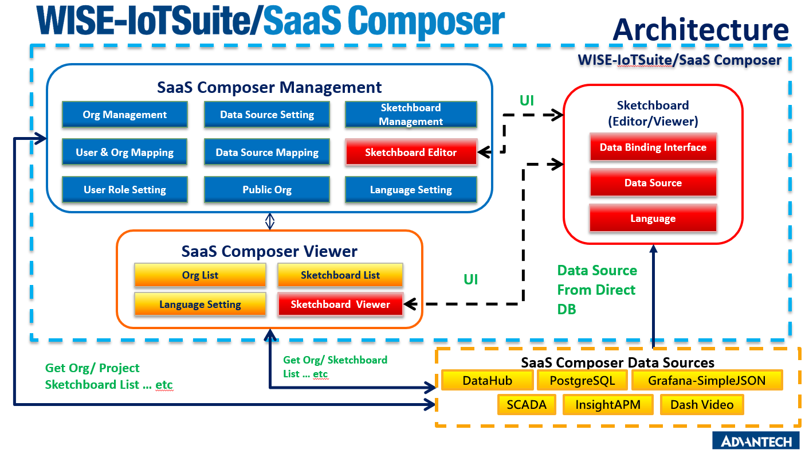


SaaS Composer的功能架構主要為以上結構組合而成：
- 藍色區塊：表示Management的使用者權限管理功能
- 橘黃區塊：表示Sketchboard顯示的頁面功能
- 紅色區塊：代表Sketchboard 繪圖的圖控軟件

資料來源會是以WISE-PaaS上的PostgresSQL來做存取。
SaaS Composer 的Management 管理方式在許多方面都與Dashboard有相似的結構與功能。

# 2 SaaS Composer - Management

## 2.1 Management 使用者權限介紹

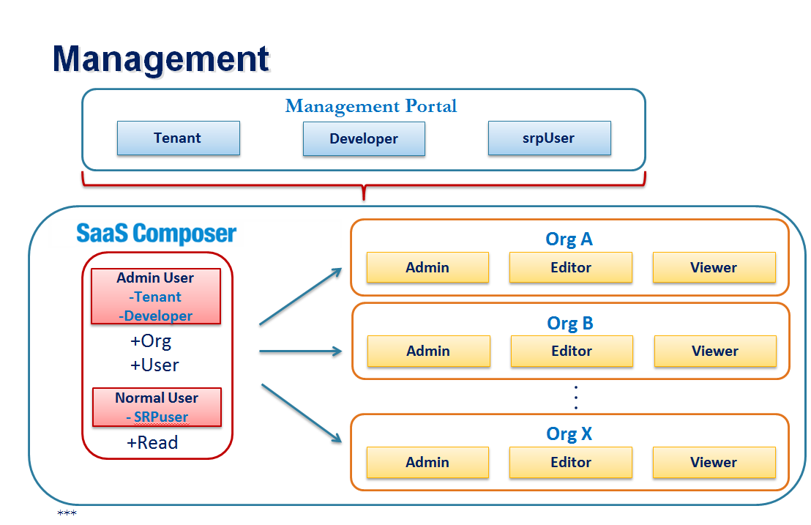

SaaS Composer Management 的權限分配主要為2層，外層管理Organization，與內層管理各Organization 內部的使用權限。

## 2.2 外層使用者分配
使用者在WISE-PaaS平台上的Org/space權限可以由Management Portal (portal-management.wise-paas.com)來管理， Management Portal把使用者劃分為3大類: Tenant, Developer, srpUser.

而SaaS Composer 的Management外層管理會比照使用者在Management Portal的權限來做分配，如果使用者在Management Portal的權限為Tenant or Developer，在進入SaaS Composer後則會自動給予 “Admin User” 的管理權限。
如果在Management Portal的權限為srpUser，則會分配 “Normal User” 權限。

Admin User跟 Normal User的權限差別在於Admin User可以創建新的Organization，與增加使用者到SaaS Composer用戶管理，Normal User的功能只能限制於觀看與被分配的角色。

## 2.3 內層使用者分配
SaaS Composer 的Management可以新增多數的 Organizations，內層使用者等同於在Organization裡面使用的使用者，各個Organization裡的權限管理都是獨立的，不會互相干擾。

內層使用者在每一個Organization裡面有區分為3個級別: Admin, Editor 和 Viewer。權限的區分為以下標準:

|          | Admin          | Editor         | Viewer |
| -------- | -------------- | -------------- | ------ |
| 繪圖板   | 新增/修改/觀看 | 新增/修改/觀看 | 觀看   |
| 資料來源 | 新增/修改      | 新增/修改      | x      |
| 用戶     | 新增/刪除      | x              | x      |

## 2.4 Management介面介紹

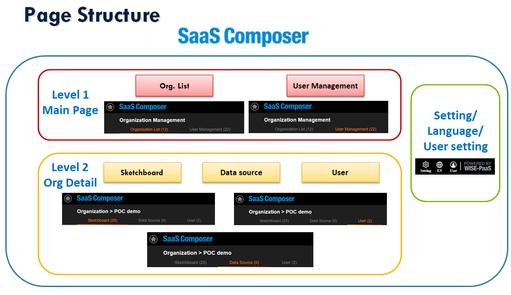

Management的頁面架構主要分為2層: 主頁 與 組織資訊。

第一層為”主頁”

主頁提供SaaS Composer裡所有跟目前登入者有相關的組織列表 和 所有使用者清單。使用者可以依照用戶的權限來做編輯/修改/新增/刪除 的設定。

第二層為”組織資訊”

組織資訊提供目前使用者點選的組織細項資訊，包含Sketchboard的圖紙，Sketchboard使用的資料來源 和 跟當前組織有使用權限的用戶。使用者可以依照用戶的權限來做編輯/修改/新增/刪除 的設定。

其次為額外的設定
包括語言，帳密，和版本資訊等。

### 2.4.1 用戶列表

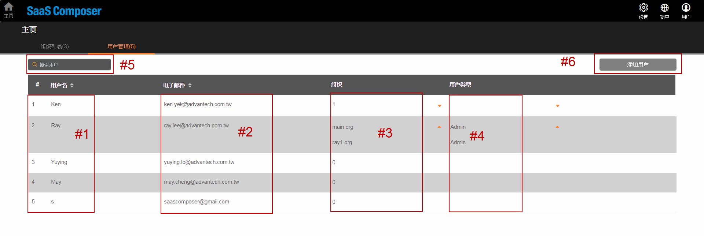

1. 所有外層的使用者名單。(最長限制64字元)
2. 所有外層的使用者郵件清單。
3. 與使用者有參與的Org清單。
4. 與使用者有參與的Org清單顯示對應的權限。
5. 用戶搜尋功能欄。
6. 增加使用者 。(依照用戶權限來開啟或隱藏此功能)

### 2.4.2 Org列表

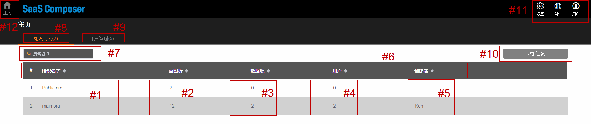

1. 與使用者相關的 Org 清單。(最長限制64字元)
2. Sketchboard 圖紙存檔數量。
3. 資料來源數量。
4. 參與此Org 用戶人數。
5. Org 創建者。
6. 排序功能選單。
7. Org 搜尋功能欄。
8. Org列表頁面切換。
9. 用戶列表頁面切換。
10. 增加Org。(依照用戶權限來開啟或隱藏此功能)
11. Configuration 選單。
12. 主頁/(Org列表頁面切換)。

### 2.4.3 Org -> Sketchboard列表/繪圖板

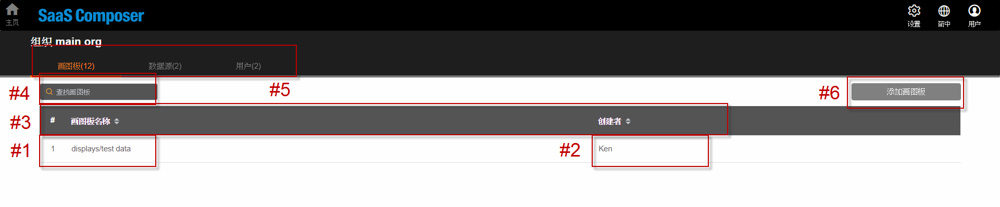

1. 所有Sketchboard圖紙路徑列表。
2. Sketchboard 原創者。
3. 排序功能選單。
4. Sketchboard搜尋功能欄。
5. Sketchboard/Data source/User頁面切換。
6. 新增Sketchboard。(依照用戶權限來開啟或隱藏此功能)

### 2.4.4 Org -> Data Source列表/數據源

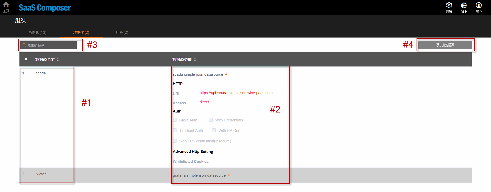

1. Data Source名單。(最長限制64字元)
2. Data Source 清單與屬性。
3. 搜尋功能欄。
4. 新增資料來源。(依照用戶權限來開啟或隱藏此功能)

### 2.4.5 Org -> User列表/用戶


1. 使用者名單。
2. 使用者郵件清單。
3. 使用者的權限。
4. 用戶搜尋功能欄。
5. 增加使用者 。(依照用戶權限來開啟或隱藏此功能)
- Note:
每個Org裡最少會有一位admin權限的用戶，刪除用戶時會做驗證。
最後一位被刪除時，會有提示訊息並阻擋刪除動作。

### 2.4.6 組織設定  

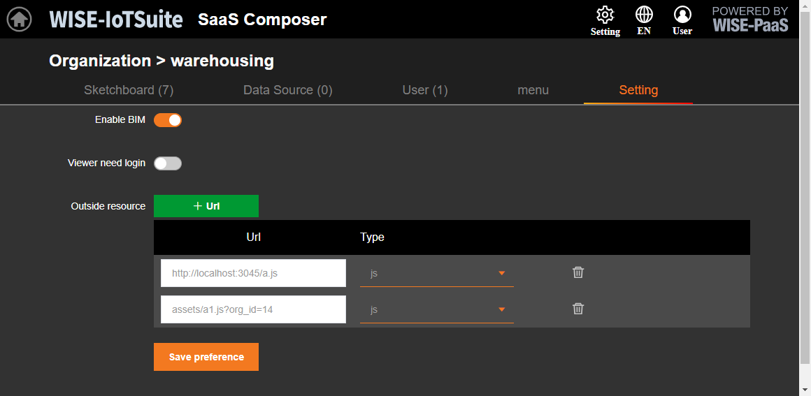  

1. 啟用 BIM 功能顯示.  
2. 啟用 預覽登入.  
3. 預覽時 添加外部第三方 js & css 檔.  

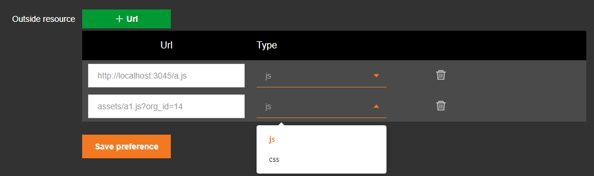

## 2.5 系統資訊  

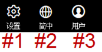

1. 設定。
2. 語言。
3. 用戶資訊。

### 2.5.1 系統設定

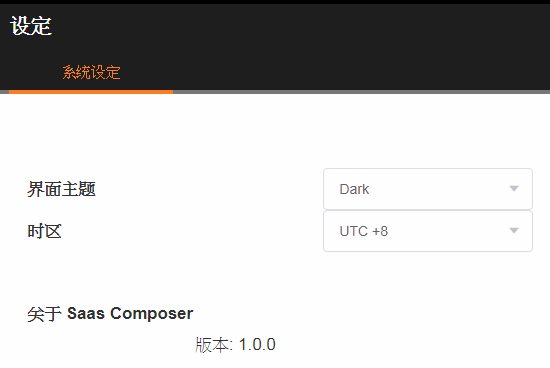

### 2.5.2 更新紀錄  

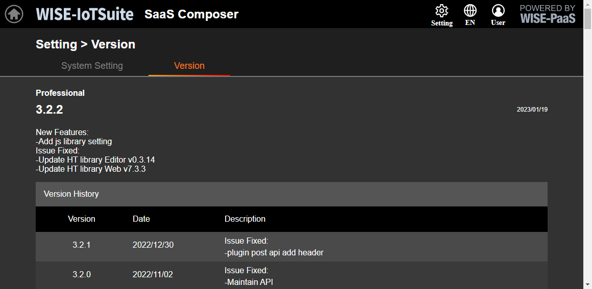

### 2.5.3 用戶資訊

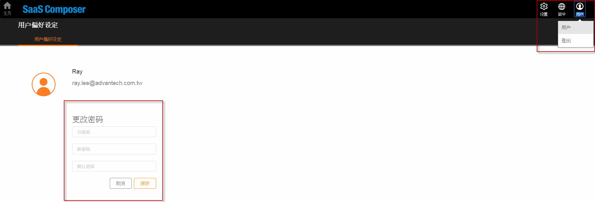

# 3 SaaS Composer - Sketchboard


## 3.1 Editor繪圖介面介紹

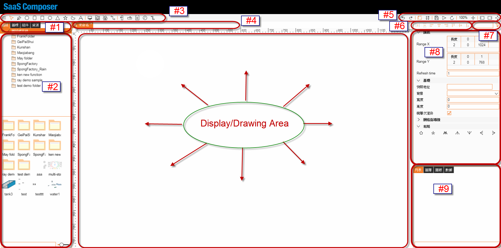

1. 主要的4種檔案分類：圖紙，圖標，組件，資源。
2. 依照選取的檔案種類顯示相對的目錄結構。
3. 繪圖工具單元物件。
4. 開啟/修改檔案清單。
5. 檔案/介面相關功能操作。
6. 繪圖物件排版快捷鍵。
7. 物件屬性搜尋功能。
8. 物件屬性欄。
9. 檔案內容列表及其他屬性。

## 3.2 Terminology

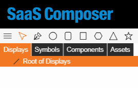

- 資源 Assets :
```
	基礎元件，支援檔案格式（PNG, JPEG, SVG）
```
- 組件 Components :
```
	編輯物件屬性的細項，邏輯/script處理
```
- 圖標 Symbols :
```
	由多項元件，組合而成的物件
```
- 圖紙 Displays :
```
	由多項物件，組合而成的畫布
```

### 3.2.1 Assets資源

- 基礎元件為圖控的常用重要資源，Sketchboard支援PNG和JPG等市面上常規格式。
- 縮放大小會導致傳統的PNG, JPG等固定尺寸資源會有失真，模糊等問題。 在這方面Sketchboard加入支援SVG向量圖型，以確保在進行畫面縮放時或調整螢幕比例的動作時，能以完美的原圖展現。

- 建議使用SVG，比傳統圖片格式更省空間，縮放不失真，可調整修改 ，SVG所有圖形參數皆可動態綁定數據。

- Assets提供目錄結構 / 檔案分類 / 拖拉移動檔案的UI操作功能。

- 以滑鼠拖拉的方式從視窗匯入SaaS Composer的Assets當中。

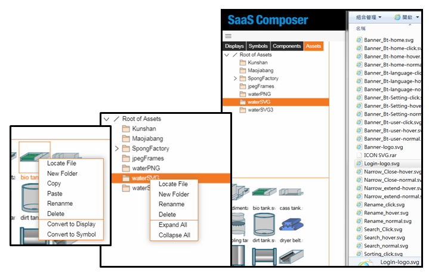

### 3.2.2 Components 組件

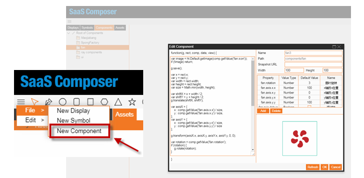

- 撰寫腳本/Script功能，提供標準Javascript邏輯分析，同時也能搭配物件屬性，串聯編輯動畫。

- Components提供目錄結構 / 檔案分類。

- 可以存成圖標在繪製到圖紙上。

### 3.2.3 Symbols圖標

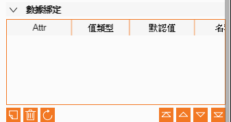

- 圖標為匯入圖紙的主要物件之一，可合集組件與資源進行二次邏輯處理。

- 以統一的物件來繪製上圖紙。

- 可以自定義綁定的屬性及格式。

### 3.2.4 Displays 圖紙

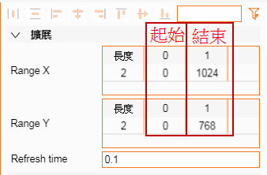

- Sketchboard的畫紙大小是以虛擬PX來做特別處理，所以不會有圖紙尺寸限制的問題，可以任意的縮放大小。
- Range X & Range Y

  這X， Y屬性會反應在Sketchboard Viewer的顯示內容範圍。

  Ex:

  Sketchboard Viewer會顯示圖紙上

  X-axis: 0px ~ 1024px的內容

  Y-axis: 0px ~ 768px的內容

- Refresh Time

  反應圖紙重劃的速率，單位以秒做基準。

## 3.3 創建圖紙/圖標

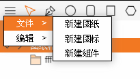

將滑鼠移到視窗左上角，然後點擊"三條橫槓"的圖標。 然後從“文件”中選擇“新建圖紙”以創建圖紙。

新建圖紙或打開圖紙後工具列才會出現以下快捷工具:

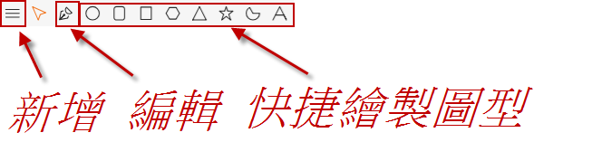

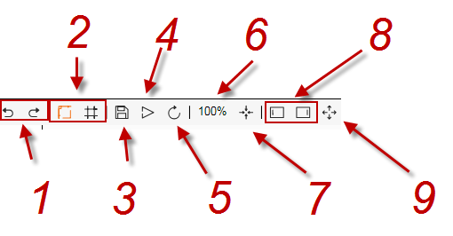

1. 復原, 取消復原
2. 顯示刻度, 網格, 啟動是橘色, 未啟動是灰色
3. 存檔
4. 預覽
5. 重新加載
6. 縮放比列
7. 縮放到全屏
8. 顯示/隱藏 左右側欄
9. 全螢幕顯示

點選圖紙上的任何圖形，編輯器的右側會出現與這個圖形相關的屬性：

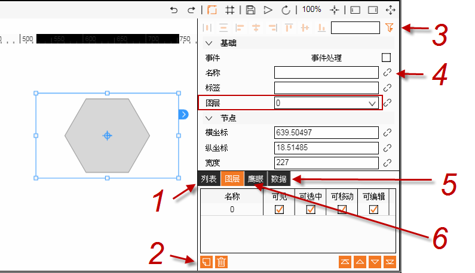

1. 樹狀關聯圖
2. 增加/刪除圖層, 選種圖形, 將圖形的圖層屬性修改成新建的圖層, 可用做分類管理
3. 過濾屬性
4. 可綁定函數
5. JSON格式敘述
6. 俯視圖

按 Ctrl/Cmd+s 保存，新建的圖紙或者圖示會彈出出入名稱的框，輸入名稱後點擊“確定” 即可保存。

## 3.4 創建組件

將滑鼠移到視窗左上角，然後點擊"三條橫槓"的圖標。 然後從“文件”中選擇“新建組件”以創建組件。

新建元件會直接生成一個彈出框繪製函數 function (g, rect, comp, data, view) {}

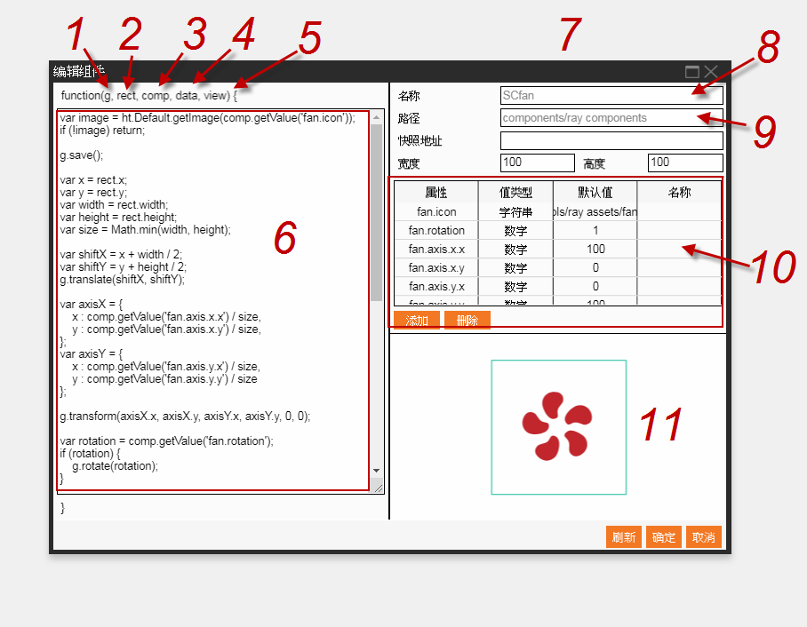

1. g = 畫筆
2. rect = 向量圖形中的矩形邊界
3. comp = 向量圖形的組件類型
4. data = 當前關聯的 Data 物件
5. view = 視圖
6. 具體繪製代碼
7. 放大縮小
8. 註冊名稱
9. 相對路徑
10. 表格顯示所創建圖像的所有屬性，以及它們的值和值類型，在繪製函數中可通過 comp.getValue(屬性名)來獲取這個屬性的值
11. 函數繪製結束後點擊刷新，這裡會顯示函數繪製出的圖形

## 3.5 編輯器快捷鍵

1. 縮小：減號（-）/ 滾輪
2. 放大：加號（+）/ 滾輪
3. 適配窗口：數字 0
4. 複製：ctrl + c
5. 貼上：ctrl + v
6. 右鍵功能選項

```
  移至頂層： alt + ctrl + ]

  上移一層： ctrl + ]

  下移一層： ctrl + [

  移至底層： alt + ctrl + [
```
7. 保存：ctrl + s

8. 預覽功能： P
9. 刪除：delete
10. 結束不規則圖形創建：ESC / enter
11. 固定水平移動圖標：按住 X 鍵，左右移動鼠標光標
12. 固定垂直移動圖標：按住 y 鍵，上下移動鼠標光標
13. 自動固定水平/垂直移動圖標：按住 Shift 鍵
14. 您可以將圖標貼上到相鄰的圖標或網格線。 啟用或禁用網格：按 Command 或 Ctrl 鍵。
15. 按住Shift鍵，同時拖動圖標的八角去調整圖標大小，或旋轉圖形（用鼠標光標單擊框的邊緣）並將其以±15°的角度粘貼到相鄰的圖形上。
16. 如果 Shape 只有兩個點，將直接進行編輯點模式，以 45 度步進吸附：按 shift 鍵
17. 畫布未選中圖標時，按方向鍵進行畫布平移，按 shift 平移增加 10 倍步進，考慮 zoom 縮放情況
18. 畫布選中圖標時，按方向鍵進行選中圖標移動，按 shift 移動增加 10 倍步進，不考慮 zoom 縮放情況
19. 按兩下 SVG 轉換成新的圖紙，按 shift 按兩下轉換成圖示
20. 斷開多邊形線段功能：按 shift + delete
21. 圖標複製移動功能：按住 alt 鍵
22. 按兩下或者按 enter/esc 可切換 edge 整體圖標編輯和控制點編輯的狀態切換
23. 要在手繪線邊緣上切換控制點的編輯模式，請按數字鍵1（直線），2（鏡像），3（斷開）或4（非對稱），或從菜單欄上的屬性面板中選擇四種模式中的任何一種。 SaaS Composer窗口的右側。
24. 按 delete 可刪除當前操作線條的 “邊” 的控制點
25. 按 shift 鍵時等比改變圖標大小
26. 多圖標選中時
-- 可進行整體中心旋轉
-- 按住 ctrl ，則圖標繞各自的中心點旋轉
-- 按住 alt ，則繞公共中心點旋轉並複製多圖標，注意，若需要多個複製，則需要將滑鼠放開，再進行旋轉
27. 編輯圖標時按 alt 鍵拷貝出新圖標進行編輯，結合 shift 鍵吸附可快速構建出環形圖標集
28. 撤銷：ctrl+z
29. 回退撤銷，也就是 redo 的功能：ctrl+shift+z
30. 重新命名方式：
-- 鼠標拖移到選項下樹圖中的圖標名稱，雙擊左鍵即可
-- 右鍵單擊該文件夾，然後從彈出菜單中選擇“重命名”
30. 雙擊“列表”中的圖標，實現置中功能

## 3.6 Data binding
- 畫面上的物件屬性跟資料做綁定設置

- 所有的屬性都可以與資料做綁定

- 同一物件可以綁定多種資料來達成多重動畫效果

### 3.6.1 Data source
- 提供Data資料來源選擇
- 資料格式:
```
  -Time Serises

  -Table
```
- 資料支援SimpleJson

- 格式內容與WISE-IoTSuite/Dashboard相同，可互相使用。

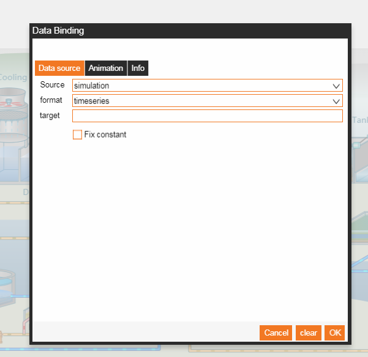

### 3.6.2 Animation - Basic
- 主要分2種模式: Basic 與 Advanced
- Basic 可以選取Set Match 和 Set Interval

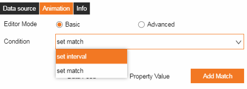

- Set Match: 可以讓配好的回傳值做一次資料配對的邏輯處理，或者可以勾選”Direct Feed”讓資料直接寫入屬性內。
- 以下範例:

  回傳值如果等於1，則會寫入False到屬性內

  等於0，則會寫入True

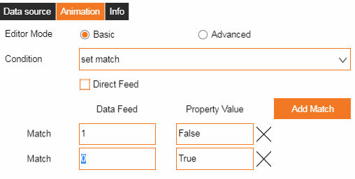

- Set Interval: 可以讓配好的回傳值做一次資料邏輯處理。以下範例:

  回傳值如果 X <= 50，則會寫入Low到屬性內，

  如果50 < X <=100，則會寫入High

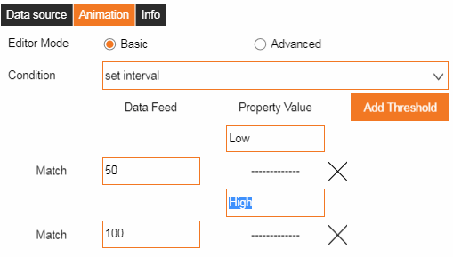

- Basic會依照屬性的格式來做相對應的Set match/interval
- 以下範例是當選取顏色屬性的格式。

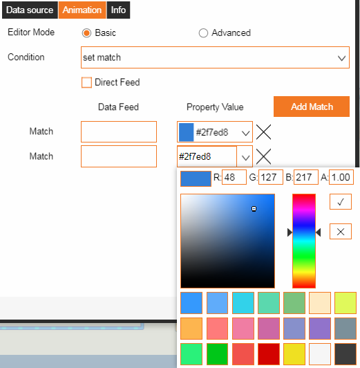

### 3.6.3 Animation – Advanced
- Advanced 的Animation提供使用者標準的Javascript來處理回傳的資料進行邏輯分析。
- 以下範例:

  input -> 綁定好的資料回傳值

  output -> 寫入到屬性的值

  每次回傳值會加1，再寫入到屬性裡

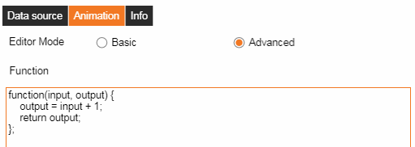

## 3.7 URL parameter
- Editor:

- https://XXXXXX.com/?display=displays/tank3.json
(要從 displays 目錄開始這個跟restful api 路徑有關)

- https://XXXXXX.com/?lang=en

- Viewer:

- http://XXXXXX.com/display.html?tag=displays/ff/AAA.json
(在view的時候用 tag)

- http://XXXXXX.com/display.html?tag=displays/ff/AAA.json&fullscreen=1
(加上參數 fullscreen = 1 會隱藏banner)

## 3.8 Script
- 在Animation的script裡是依照標準的Javascript來做處理

- 可以下中斷點

- 可以印出log

- 在同一頁面(tab)上可以有共同的global variable

- 可以有alert視窗

- 控制頁面屬性及event
